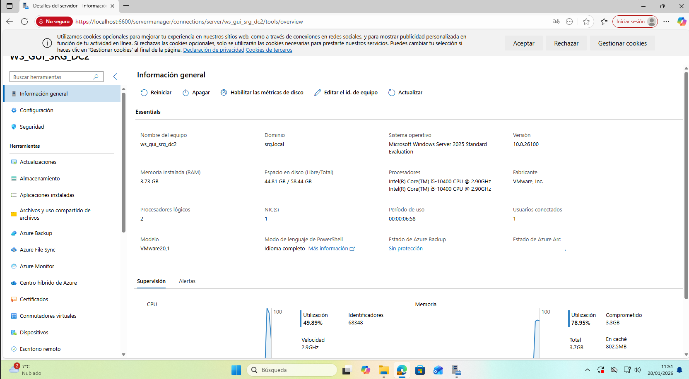
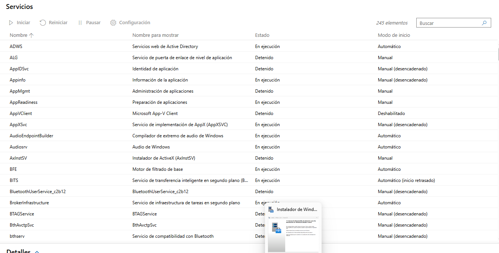
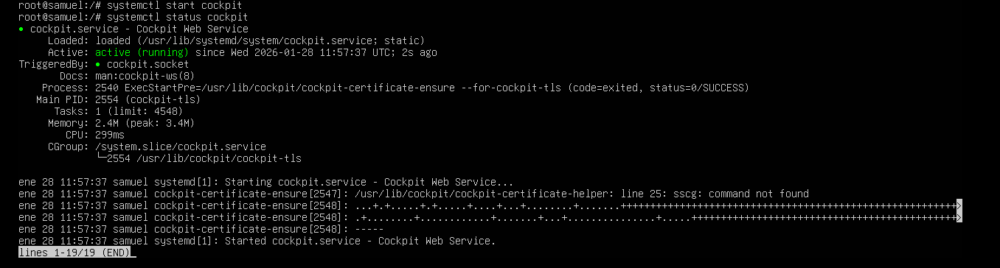
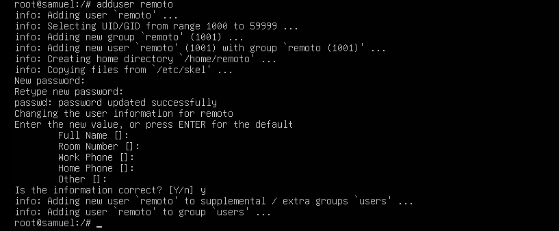
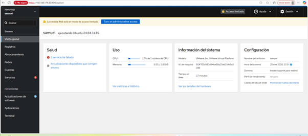

# UT4 ADMINISTRACION REMOTO

## WAC-------ACCESO A WINDOWS SERVER

### Lo primero que he echo ha sido descargarme el windows admin server y luego una vez instalado he añadido nuestro Windows Server para poder ver los apartados que nos pide el ejercicio.

### Ahora vamos a ver los apartados que nos pide el ejercicio. Veremos la CPU y la MEMORIA de nuestro Windows Server 

### Y otro apartado que nos pide son los servidores

### Por ultimo tendremos que hacer la tabla que nos pide el ejercicio

| Sistema administrado | Herramienta | Protocolo | Puerto |

|-Windows server-|-WAC-|-Windows Admin Center-|-6600-|

## COCKPIT-------COMPROBACION DEL SERVICIO COCKPIT

### En el servidor Ubuntu vamos a comprobar que el servicio de cockpit esta activo y funcionado. Primero he tenido que instalar el cockpit. Y comprobar que esta corriendo y activo.

### Ahora vamos a hacer un usuario nuevo remoto.

## ACCESO REMOTO DESDE WINDOWS 11

### Ahora una vez dentro del Windows 11 podemos acceder al COCKPIT y comprobar toda la monitorizacion. Desde ahi podemos ver la informacion de la CPU y de la MEMORIA. 

### Lo unico que nos falta ahora,es hacer la tabla.

| Sistema | Usuario remoto | Herramienta | Protocolo | Puerto |

|-ubuntu server-|-REMOTO-|-COCKPIT-|-TCP-|-9090-|
