# SAMUEL RUIZ
## Acceso SSH

### Usuario autorizado: remoto_ssh
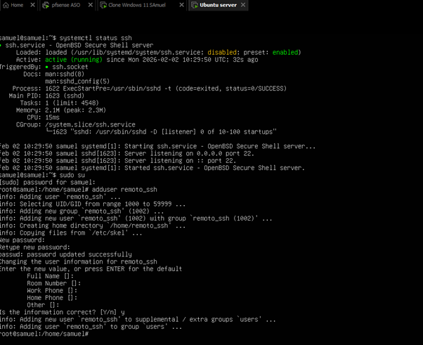

Observamos que ya tenemos el ssh corriendo y funcionado.Y creamos un usuario llamado remoto_ssh.  

### Cliente: PuTTY  
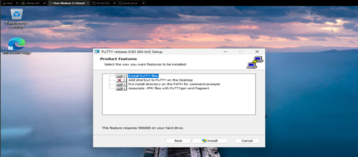

Empezamos a instalar el PUTTY 

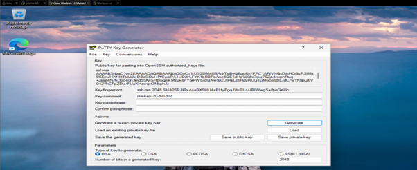

Aqui ya podemos ver que hemos creado la clave que necesitamos para entrar en el usuario.
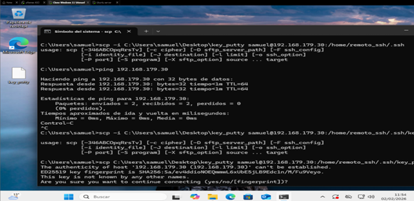

En esta captura vemos como tenemos que hacer un scp para pasar la clave al ubuntu server
 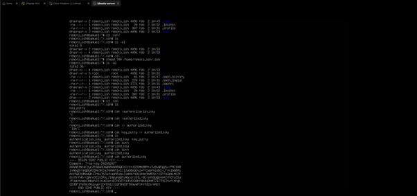

Aqui ya podemos ver desde el ubuntu server como se ha pasado correctamente la clave
### Autenticación: clave pública  
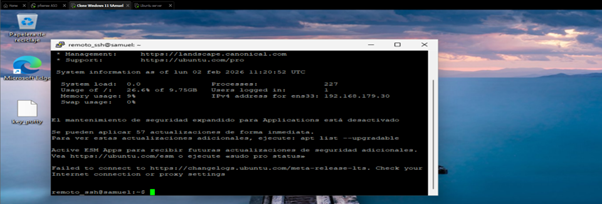

En esta captura vemos como nos ha conectado al ubuntu sin necesidad de meter la contraseña solo con la clave
### Contraseña por SSH: deshabilitada
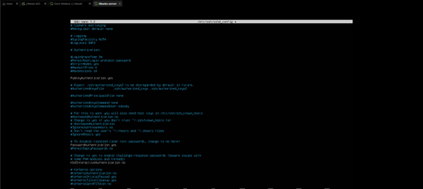

Aqui entramos al fichero para deshabilitar el acceso por contraseña
### Usuarios no autorizados: acceso denegado 
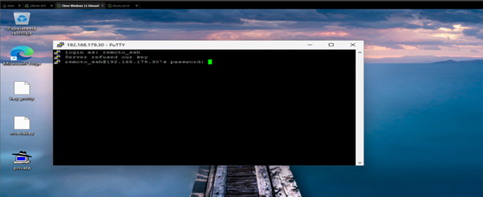

Ahora al entrar probar con usuarios no autorizados no nos deja entrar con la clave y nos pide la contraseña

## Acceso RDP

### Usuario RDP: remoto_rdp
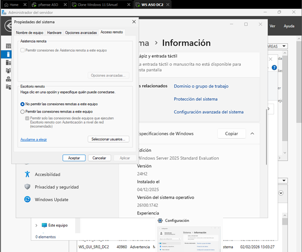

Dentro de Windows Server vamos a habilitar el escritorio remoto 
En Windows Server:
Botón derecho en Este equipo,
Propiedades,
Configuración avanzada del sistema,
Pestaña Acceso remoto.

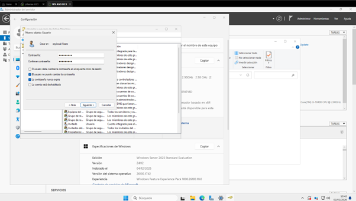

Creamos el usuario y le ponemos una contraseña pero tambien le marcamos que no expire la contraseña

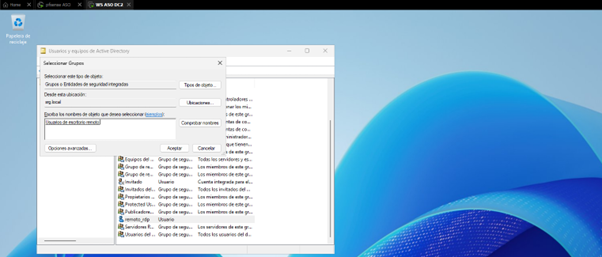

Y le añadimos al grupo usuarios de escritorio remoto
### Sistema administrado: Windows Server 2025
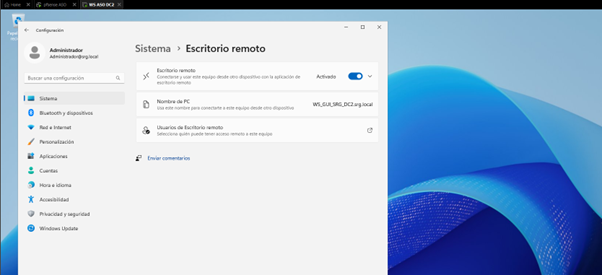

Aqui tenemos que marcar esta opcion de escritorio remoto para que se le puedan unir
### Protocolo: RDP  
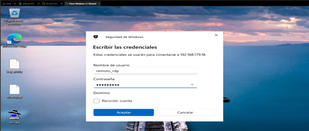

Aqui vemos como desde el Windows11 añadimos remotamente el usuario remoto_rdp con la contrasña que le pusimos anteriormente
### Grupo de acceso: Usuarios de Escritorio remoto  
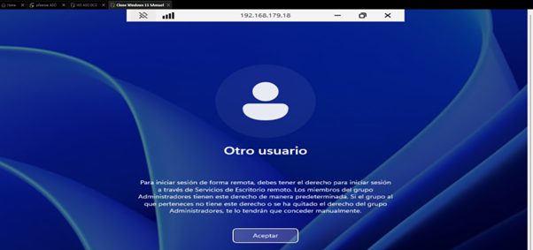

Ahora comprobamos que funciona y se nos ha conectado correctamente
### Cifrado: Sí  
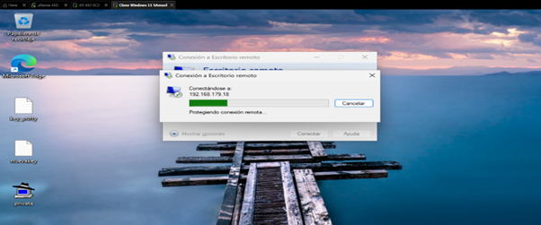

Ahora vemos como desde otro usuario no se ha conectado,se queda pensando y no funciona
